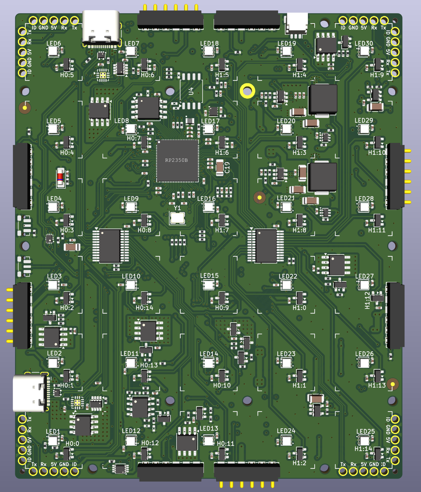
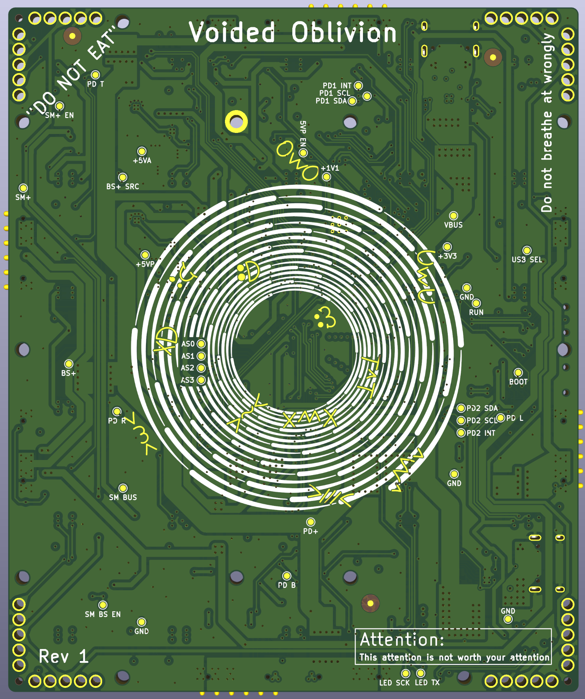

# Voided Oblivion

**An infinitely\* tileable analog hall-effect keyboard.** Identical 5×6 ortholinear tiles that
snap together edge to edge in any arrangement, two tiles for a 60%, three for an 80%, four for
full size. Each tile is a complete unit with its own RP2350B, dual USB-C PD ports, and power
system.

Designed by **Clover**




**Status: design complete, ordering boards.**

<sub>\* not actually infinite. one PD port runs about four tiles, after that you need more
ports - see [power](docs/design-choices/power.md).</sub>

---

## At a glance

|                 |                                                                                     |
| --------------- | ----------------------------------------------------------------------------------- |
| **Board**       | 4-layer, ~425 components, 242 nets                                                  |
| **MCU**         | RP2350B, 44/48 GPIO, 6/8 ADC, 12/12 PIO state machines                              |
| **Dual USB**    | 2 USB-C ports for ease of use when rotating the module(s) 90°                       |
| **Power**       | FUSB302 PD port(s), TPS54302 bucks, comparator-based VBUS→PD/BS handoff             |
| **Sensing**     | Analog hall effect, 74HC4067 muxes into the ADC, 30 keys/tile                       |
| **Performance** | 1000 Hz polling, sub-1 ms latency, rapid trigger (in theory)                        |
| **Effort**      | 100 hours across 40 days, June–August 2026                                          |

---

## The parts i find most interesting/difficult

**Stupid people ~~proofing~~ resistanting.** *so* many things would have been so much easier if
i were just designing this for myself, but i'm not. i had to think of random scenarios like
*'what if someone plugs both USBs in at the same time?'*, i had to add protection circuits for
that. 'what if someone wanted to put 64 of them together?' (ok that one i would do if i had that
many >w<) and minimizing the damage that a short between the outer pogo pins can do, and several
other random things that i would just think 'i wont do that'

**Power system.** this project uses USB power delivery for 2 main reasons. non PD is not enough
power for more than like 1 tile (with rgb) and with PD i can run a higher voltage across the
whole network without worrying about voltage drop. But PD comes with its problems, the switch
from 5v to higher voltages, i designed a comparator based system so all the power routing would
happen with hardware so a firmware mistake ~~wouldn't~~ couldn't fry anything.
→ [power](docs/schematic-design/power.md)

**Everything budgeted onto one MCU.** 44 of 48 GPIO, 6 of 8 ADC channels, 12 of 12 PIO state
machines. The interesting thing is that PIO uart is faster than hardware uart.
→ [pin budget](docs/design-choices/pin-budget.md)

---

## What's in here

| | |
| --- | --- |
| [`Voided-Oblivion/`](Voided-Oblivion/) | the KiCad 10 project - schematic, PCB, and the JLCPCB gerber/drill output |
| [`docs/`](docs/) | the design documentation, written while designing. an MkDocs site, but readable as plain markdown on GitHub |
| [`layouts/`](layouts/) | keymaps in [keyboard-layout-editor](http://www.keyboard-layout-editor.com/) JSON, from 60% up to the silly ones |
| [`scripts/`](scripts/) | tooling for the layouts and docs - deriving one arrangement from another, image-to-keymap, etc |
| [`Refrences/`](Refrences/) | datasheets, the RP2350B minimal-board reference archive, and stitched recommended-layout pages |
| [`analysis/`](analysis/) | dated analyzer output from the review passes |
| [`graphics/`](graphics/) | silkscreen art |
| `old/` | the first attempt, kept for reference |

## Reading the docs

Start at [`docs/index.md`](docs/index.md). These are working engineering documents written
during the design process, not a writeup made afterwards, so **incorrect reasoning is kept**
rather than deleted, with a link to whatever replaced it. That's deliberate - the point is
remembering *why* something changed.

- **what got designed** - [chip list](docs/chips.md) · [schematic calcs](docs/schematic-design/index.md) · [layout checklist](docs/layout-checklist.md)
- **why the chosen features** - [design decisions](docs/design-choices/index.md) · [goals and constraints](docs/goals.md)
- **how it was checked** - [design reviews](docs/schematic-review-2026-08-08.md) · [datasheet research](docs/research/README.md)

To read them as a site locally, with working cross-links and the superseded-block styling:

```sh
./preview.py
```

That builds a venv, checks every cross-link, and serves on the first free port from 8001.

## Licence

[CC BY-NC-SA 4.0](LICENSE.md), with the NonCommercial term relaxed so it only catches people
actually making money. Build it, modify it, fork it, publish your changes - just credit it and
share alike.

The carve-outs, in full in [LICENSE.md](LICENSE.md):

- **Under US$1,000/year in revenue, sell freely.** No permission needed, nothing owed. The
  NonCommercial term exists to stop a company mass-producing this, not to stop you selling a few
  boards.
- **Over that, open an issue** and we'll work out a percentage. Expect a conversation, not a no.
- **The inter-tile connector interface is public domain** - pinout, pitch, gender rule, protocol.
  Submodules and accessories that mate with a tile are entirely yours to sell, commercially,
  without asking.
