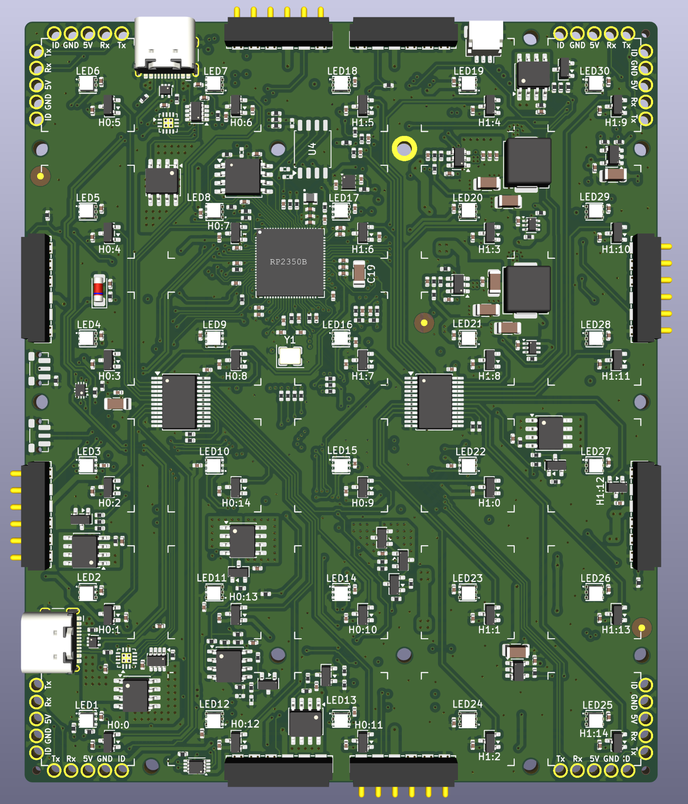
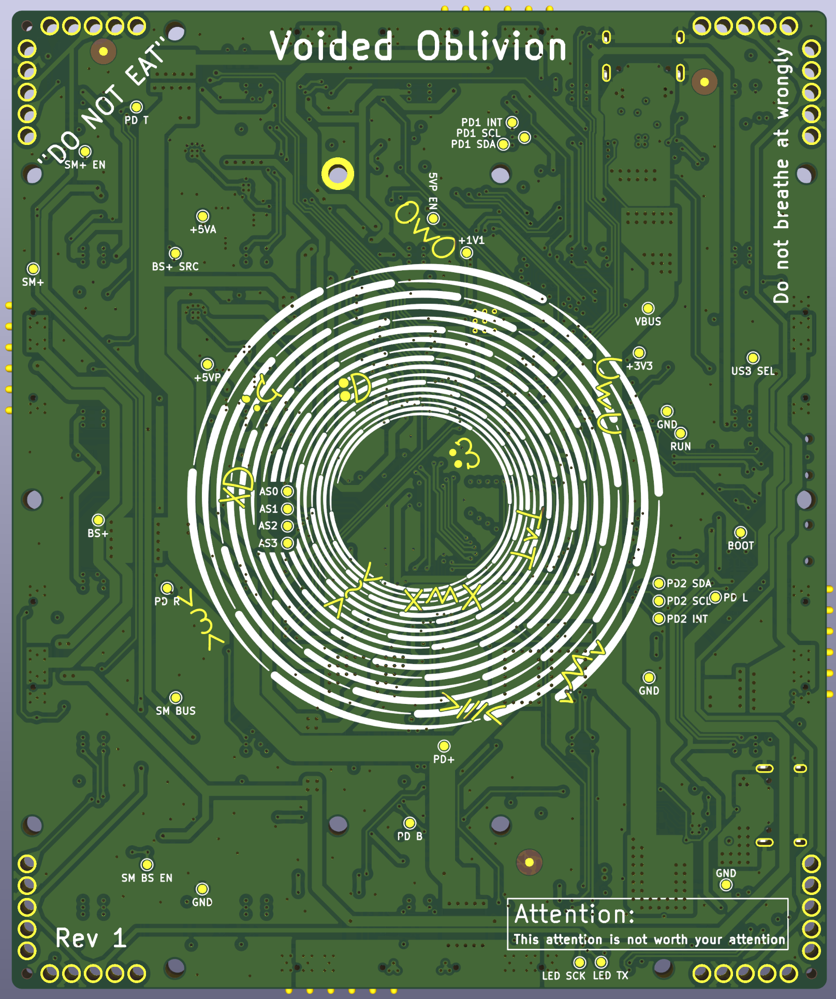

# Voided Oblivion

**An infinitely\* tileable analog hall-effect keyboard.** 5×6 ortholinear tiles that snap together edge to edge in any\*\* arrangement, two tiles for a 60%, three for an 80%, four for
full size. Each tile is a complete unit with its own RP2350B, dual USB-C PD ports, and power
system.

Designed by **Clover**

**Status: design complete, ordering boards.**

* not actually infinite but like way more than reasonable.
** in a grid, and not 6x5 to 5x6, individual tiles need to be the same orientation (portrait or landscape; they can be rotated 180° tho)

---

## At a glance

|                 |                                                                                                   |
| --------------- | ------------------------------------------------------------------------------------------------- |
| **Board**       | 4-layer, ~425 components, 242 nets                                                                |
| **MCU**         | **RP2350** (used like 44/48 GPIO, i dont think i used enough 𐔌˙.)                                |
| **Dual USB**    | 2 USB-C ports for ease of use when rotating the module(s) 90°                                     |
| **Power**       | FUSB302 PD port(s), TPS54302 bucks, comparator-based VBUS→PD/BS handoff                           |
| **Sensing**     | Analog hall effect, 74HC4067 muxes into the ADC, 30 keys/tile                                     |
| **Performance** | 1000 Hz polling, sub-1 ms latency, rapid trigger (in theory, if firmware is good at firmware-ing) |
| **Time**        | ~100 hours spent on this project                                                                  |

---

## The parts i find most interesting/difficult

**Stupid people ~~proofing~~ resistant-ing.** *so* many things would have been so much easier if i were just designing this for myself, but i'm not. i had to think of random scenarios like *'what if someone plugs both USBs in at the same time?'*, i had to add protection circuits for that. 'what if someone wanted to put 64 of them together?' (ok that one i would do if i had that many >w<) and minimizing the damage that a short between the outer pogo pins can do, and several other random things that i would just think 'i wont do that'

**Power system.** this project uses USB power delivery for 2 main reasons. non PD is not enough power for more than like 1 tile (with rgb) and with PD i can run a higher voltage across the whole network without worrying about voltage drop. But PD comes with its problems, the switch from 5v to higher voltages, i designed a comparator based system so all the power routing would happen with hardware so a firmware mistake ~~wouldn't~~ couldn't fry anything.
→ [power](docs/schematic-design/power.md)

**Everything budgeted onto one MCU.** 44 of 48 GPIO, 6 of 8 ADC channels, 12 of 12 PIO state machines. The interesting thing is that PIO uart is faster than hardware uart.
→ [pin budget](docs/design-choices/pin-budget.md)

---

## What's in here

|                                        |                                                                                               |
| -------------------------------------- | --------------------------------------------------------------------------------------------- |
| [`Voided-Oblivion/`](Voided-Oblivion/) | KiCad files                                                                                   |
| [`docs/`](docs/)                       | the design documentation                                                                      |
| [`layouts/`](layouts/)                 | (proposed) keymaps made with [keyboard-layout-editor](http://www.keyboard-layout-editor.com/) |
| [`graphics/`](graphics/)               | silkscreen art                                                                                |

I removed the Datasheets from repo cuz they're manufacturer IP, and i would like to not make any enemies
[`docs/datasheets.md`](docs/datasheets.md) indexes every part and where to get its datasheet.
`old/` (the first attempt) is out of the working tree but still in git history.

## Reading the docs

These are working engineering documents, they were written during the design process (how it should be), and i keep incorrect reasoning/assumptions to remember *why* something changed

- **design**
	- [chip list](docs/chips.md)
	- [schematic ~~meth~~ math](docs/schematic-design/index.md)
- **features n' stuff**
	- [design decisions](docs/design-choices/index.md)
	- [goals and constraints](docs/goals.md)
- **sanity check(s)** (check if my sanity was still intack after reading so much (not quite) 'ai slop' ꩜ ᨓ𖦹)
	- [design reviews](docs/schematic-review-2026-08-08.md)
	- [datasheet research](docs/research/README.md)

## Licence

[CC BY-NC-SA 4.0](LICENSE.md), with a relaxed NonCommercial term so it only catches people actually making money. Mostly just do whatever, i would like some credit tho (,,¬﹏¬,,)

The carve-outs (full stuff in [LICENSE.md](LICENSE.md)):

- **Under US$1,000/year in revenue, sell freely.** No permission needed, nothing owed. The NonCommercial term is just to stop some small-medium sized company profiting off *my* work. I support the community and don't want to stop group buys or making a few for a friend or something like that.
- **If you do want to sell** (more than $1000) just talk to me (issue probably works) we can work out some sort of compensation. I probably won't say no.
- **The connector interface(s) are public domain** anyone can make/design their own submodule or even own tile if they want, it's encouraged ദ്ദി ˉ͈̀꒳ˉ͈́ )✧ 

## On LLM use

i used LLMs while working on this, ima just say how they were used.

**what they did:** the [datasheet research pages](docs/research/README.md) were written by agents that were given a datasheet and what the chip was supposed to do, and *not* shown my schematic so their conclusions could be diffed against what i'd actually designed. same shape for the [review passes](docs/electrical-review-2026-08-20.md), caught errors i made by looking at things too close. they also helped with editing the docs some, and wrote some of the tooling in `scripts/`.

**what they didn't:** ideas, design decisions, the modular architecture, the schematic, and the layout are mine. all the ideas in [schematic-design](docs/schematic-design/index.md) are mine. for example, some of the LLM research was different than what i had designed in the schematic, it exposed some mistakes i had made, and sometimes the research was backwards and would have me make a switch that couldn't turn on. the actual choices genuinely couldn't be made by a llm and this still be a good project

also a lot of the reviews were mostly useless/irrelevant 'fluff' (immediately dismissable with 0.8ms of thought with context (￢ \_￢ ) ) but did actually catch real stuff that needed fixing

also, and i say this as someone who has spent over 100 hours on this project: LLMs could *not*
have done this. they really, really suck at it. trust me, i would know.
